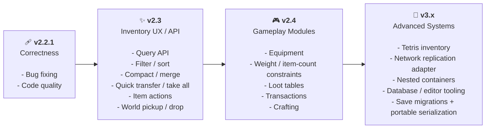

<div align="center">


# Swift Inventory

### A small, data-driven inventory system for Godot 4

Build inventories with unmatched speed.

[](https://godotengine.org/)
[](https://docs.godotengine.org/en/stable/tutorials/scripting/gdscript/)
[](addons/Swift_Inventory/plugin.cfg)

[](LICENSE)

[Godot Asset Store](https://store.godotengine.org/asset/blodyx/swift-inventory/) · [GitHub](https://github.com/BlodyxCZ/Swift-Inventory-Godot-Addon)

</div>

# 🗺️ Roadmap



## ⛑️ Development Status

Swift Inventory is actively being developed. The core inventory resources, grid UI, free-form drop areas, slots, stacking, stack-specific metadata, transfers, runtime drag and drop, and editor workflow are available now.

Targeted at Godot 4.8 and tested with Godot 4.4.1, 4.6.1, and 4.8-dev4. Godot 4.4 is the minimum because the public data model uses typed dictionaries.

Insertion rules, explicit native persistence, a hotbar, and partial-stack dragging are available. Tooltips refresh after drops and changes to hovered stacks.

If you encounter another problem, [open a GitHub issue](https://github.com/BlodyxCZ/Swift-Inventory-Godot-Addon/issues).

## 🎮 Try it now!

[▶ **Play Interactive Example Scene**](https://blodyxcz.github.io/godot-tscn-viewer/runner/?owner=BlodyxCZ&repo=Swift-Inventory-Godot-Addon&scene=res%3A%2F%2Faddons%2FSwift_Inventory%2FExample%2Fexample_scene.tscn&godot=4.7&pack=preview.pck)

## ✨ Features

- **Resource-based data** — inventory state and item definitions are independent from the UI.
- **Automatic stacking** — compatible stacks are filled before empty slots are used.
- **Slot rules** — filter items by ID, tags, custom predicates, and per-slot quantity caps.
- **Persistent inventories** — explicit `.tres`/`.res` save and load, plus separate UI state.
- **Hotbar** — a selectable range of inventory addresses with configurable input actions.
- **Partial-stack dragging** — Shift for half, Ctrl for one, wheel to adjust, and Escape to cancel.
- **Per-item stack limits** — every item defines its own `max_stack_size`.
- **Stack-specific metadata** — store durability, enchantments, or other custom state in `SwiftItemStack.instance_data`.
- **Move, split, swap, and transfer operations** — manipulate stacks within one inventory or between inventories.
- **Automatic grid reconciliation** — `SwiftGrid` creates and binds slots to match inventory size.
- **Free-form drop areas** — `SwiftDropArea` places occupied slots where stacks are dropped and supports cross-inventory transfers.
- **Runtime drag and drop** — `SwiftSlot` can move, merge, swap, or transfer stacks.
- **Editor tooling** — select generated slots and drop `SwiftItemData` resources onto them in the 2D editor.
- **Change notifications** — react to inventory mutations through one typed signal.
- **Extensible item information UI** — subclass `SwiftInfo` to create a custom tooltip or hover panel.
- **Included example** — inspect or run player, chest, and free-form drop-area inventories.
- **Lightweight integration** — no singleton is required, and the inventory logic is not tied to a particular game.

> [!TIP]
> `SwiftInventory` owns the data. `SwiftGrid`, `SwiftDropArea`, and `SwiftSlot` present and interact with that data. This separation lets multiple gameplay systems or interfaces use the same inventory resource.

## 🧩 Architecture

| Class | Base type | Responsibility |
| --- | --- | --- |
| `SwiftItemData` | `Resource` | Static item definition: ID, name, description, icon, tags, and stack limit |
| `SwiftItemStack` | `Resource` | An item definition, current amount, and optional stack-specific metadata |
| `SwiftInventory` | `Resource` | Inventory size, stacks, rules, operations, persistence, and change notifications |
| `SwiftRule` | `Resource` | Reusable insertion filters, quantity caps, and custom predicates |
| `SwiftUIState` | `Resource` | Separate persistent hotbar selections and drop-area positions |
| `SwiftContainer` | `Container` | Shared inventory reconciliation and slot management for container layouts |
| `SwiftGrid` | `SwiftContainer` | Creates, binds, sizes, and lays out every inventory address in a grid |
| `SwiftHotbar` | `SwiftGrid` | Selectable single-row view over an inventory address range |
| `SwiftDropArea` | `SwiftContainer` | Places occupied inventory slots at their free-form drop positions |
| `SwiftSlot` | `Panel` | Displays one inventory address and handles drag and drop |
| `SwiftInfo` | `Control` | Base control for a custom item hover panel |
| `Swift_Inventory.gd` | `EditorPlugin` | Adds slot selection and item-resource dropping to the 2D editor |

## 🗃️ Installation

### Godot Asset Store

1. Open the [Swift Inventory store page](https://store.godotengine.org/asset/blodyx/swift-inventory/).
2. Add the asset to your library and download it.
3. Install the `addons/Swift_Inventory` folder into your project.

### GitHub

1. Download the repository from [GitHub](https://github.com/BlodyxCZ/Swift-Inventory-Godot-Addon). (Code > Download .ZIP)
2. Copy `addons/Swift_Inventory` into your project's `addons` folder.

Your project should contain:

```text
res://
└── addons/
    └── Swift_Inventory/
        ├── Classes/
        ├── Example/
        ├── Icons/
        ├── Swift_Inventory.gd
        └── plugin.cfg
```

Open **Project > Project Settings > Plugins** and enable **Swift Inventory** to use its editor enhancements.

The scripts use `class_name`, so their types become available directly in GDScript after Godot imports the add-on. The runtime inventory API does not require an autoload.

## ⏱️ Quick Start

### 1. Create an item definition

In the FileSystem dock, create a `SwiftItemData` resource and save it as a `.tres` file. Configure it in the Inspector:

```text
id              = "health_potion"
display_name    = "Health Potion"
description     = "Restores a little health."
icon            = <your texture>
max_stack_size  = 10
tags            = ["consumable", "potion"]
```

The same `SwiftItemData` resource can be reused by every stack of that item.

### 2. Create an inventory

Create a `SwiftInventory` resource, save it as a `.tres` file, and set its size. You can also assign it to a script and populate it at runtime:

```gdscript
@export var inventory: SwiftInventory
@export var health_potion: SwiftItemData


func _ready() -> void:
    inventory.size = 24

    var remaining := inventory.try_add(health_potion, 5)
    if remaining > 0:
        print("Inventory could not fit %d potions." % remaining)
```

`try_add()` returns the quantity that could not be inserted, which makes overflow explicit.

### 3. Display it with `SwiftGrid`

1. Add a `SwiftGrid` node to a `Control`-based scene.
2. Assign the `SwiftInventory` resource to `swift_inventory`.
3. Set `inventory_size`, `slot_size`, and `separation` in the Inspector.
4. Give the grid enough width for the number of columns you want. Slots wrap to the next row based on the available width.

`SwiftGrid` creates the required `SwiftSlot` children and keeps them bound to their matching inventory addresses. Changing the inventory size automatically reconciles the grid.

### 4. Try the included example

Open and run:

```text
res://addons/Swift_Inventory/Example/example_scene.tscn
```

The original scene demonstrates grids, free-form inventories, and an item information panel. For the new features, run `res://addons/Swift_Inventory/Example/feature_demo.tscn` (F6): it includes capped equipment slots, a ten-slot hotbar, partial dragging, and Save/Load buttons.

## 🫴 Free-Form Drop Areas

Add a `SwiftDropArea` to a `Control`-based scene, assign a `SwiftInventory` to `swift_inventory`, and configure `slot_size`. When a stack is dropped onto the area, it transfers into the first available address and its `SwiftSlot` is positioned at the drop point.

Unlike `SwiftGrid`, a `SwiftDropArea` only creates a visible slot when a stack is explicitly dropped and positioned in the area. Programmatic additions become visible through `set_slot_position(address, top_left)` or restored UI state. Drops search for an eligible empty address and may expand the inventory by one address if needed and allowed by its rules. Repositioning a whole stack already in the area keeps the same address and capacity.

## 🔀 Editor Workflow

With the plugin enabled:

1. Select a configured `SwiftGrid` in the 2D editor.
2. Click one of its generated slots. The first click selects the `SwiftGrid`; with the grid selected, a second click inspects the `SwiftSlot`.
3. Drag a `.tres` file containing `SwiftItemData` from the FileSystem dock onto a visible slot. The cursor changes to the can-drop shape over a valid target.
4. Select the slot to adjust its item or amount in the Inspector.

These edits update the assigned `SwiftInventory` resource and honor its rules. Resource drops support Undo/Redo, transformed slots are hit-tested in local coordinates, and changing an amount preserves stack metadata. Only `.tres` resources containing `SwiftItemData` are accepted by the editor drop workflow.

## 🛠️ Working With Items

### Add items

```gdscript
var remaining := inventory.try_add(item_data, 20)

if remaining > 0:
    print("%d items did not fit." % remaining)
```

`try_add()` creates stacks with empty `instance_data`. It fills compatible existing stacks, then eligible empty addresses until the quantity is exhausted or no compatible capacity remains.

### Remove items

```gdscript
var result := inventory.try_remove(3, 2)

if result != OK:
    print("Could not remove the requested items.")
```

`try_remove()` succeeds only when the address is valid, contains a stack, and holds the full requested quantity.

### Move or merge stacks

```gdscript
var remaining := inventory.try_move(
    0, # source address
    5, # destination address
    3  # quantity
)
```

An empty destination receives the stack or a split stack. A compatible destination is filled up to its effective item/rule limit. Item IDs, metadata, and stored stack extension fields must match. A split stack receives a deep copy of the source metadata so later changes do not affect the original stack.

### Swap stacks

```gdscript
var result := inventory.try_swap(0, 4)
```

Both addresses must contain an item. To swap occupied addresses between inventories:

```gdscript
var result := inventory_a.try_swap(
    0,
    2,
    inventory_b
)
```

### Transfer between inventories

```gdscript
var remaining := inventory_a.try_transfer(
    0,           # source address
    inventory_b,
    3,           # destination address
    5            # quantity
)
```

To transfer as much of an entire inventory as possible:

```gdscript
var result := inventory_a.transfer_to(inventory_b)
```

`transfer_to()` returns `OK` only when the source inventory becomes empty. It returns `FAILED` if any items remain.

Transfers preserve `instance_data` and fill compatible destination stacks before using empty addresses.

### Set or clear an address

```gdscript
inventory.set_stack_from_data(4, item_data, 3)
```

`set_stack_from_data()` validates the address, clamps the quantity to the item's `max_stack_size`, and emits a change notification. Clear the address by passing `null` or a non-positive quantity:

```gdscript
inventory.set_stack_from_data(4, null)
```

Use `set_stack()` when you already have a `SwiftItemStack` resource. It validates the address, item data, positive amount, and stack capacity, then emits a `CHANGES.set` notification:

```gdscript
inventory.set_stack(4, SwiftItemStack.new(item_data, 3))
```

A stack can belong to only one inventory address; use `stack.copy()` to create independent contents or transfer the existing stack. Pass `null` to clear an occupied address. Use `has_stack(address)` and `get_stack(address)` for validated stack queries. Mutating the `inventory` dictionary directly is unsupported because it bypasses address validation and change notifications.

### Store stack-specific data

Pass metadata when creating a stack, or edit its `instance_data` dictionary later:

```gdscript
var sword_stack := SwiftItemStack.new(
	sword_data,
	1,
	{&"durability": 75, &"enchantment": &"fire"}
)
inventory.set_stack(4, sword_stack)
```

`instance_data` belongs to the whole stack. Use `max_stack_size = 1` when each stack must represent one independently changing item. Swift Inventory does not generate a stable item-instance ID automatically; store one in `instance_data` if your persistence model requires it.

Stacks merge only when item IDs, stack scripts, metadata, and stored stack extension fields match. Nested mutable Resources are compared by their stored values. Splitting preserves subclass fields and deeply copies mutable metadata, including Resources inside arrays or dictionaries. `try_add_stack(stack, quantity = -1)` inserts copies with that metadata; `try_add(data, quantity)` creates definition-only stacks.

## Slot Rules

`SwiftRule` is an Inspector-editable `Resource`. Assign inventory-wide rules to
`SwiftInventory.rules` and one optional additional rule per address through
`set_rule()`. Every applicable rule must pass.

```gdscript
var weapons_only := SwiftRule.new()
weapons_only.allowed_tags = [&"weapon"]
weapons_only.max_quantity = 1
inventory.set_rule(0, weapons_only)

var no_quest_items := SwiftRule.new()
no_quest_items.blocked_tags = [&"quest"]
inventory.rules = [no_quest_items]
```

| Property | Behavior |
| --- | --- |
| `allowed_ids`, `blocked_ids` | Match `SwiftItemData.id`; blocked IDs win |
| `allowed_tags`, `blocked_tags` | Match item tags; any blocked tag rejects insertion |
| `require_all_tags` | Require all allowed tags instead of any one |
| `max_quantity` | Cap the **total amount at one address**; zero uses the item limit |

Empty allow lists impose no restriction. If both allowed IDs and allowed tags are
configured, both filters must pass. The effective quantity cap is the smallest
positive rule cap and the item's `max_stack_size`.

Extend `SwiftRule` for custom checks. Predicates must not mutate inventory state;
they receive the proposed final stack, including its amount and copied metadata.

```gdscript
@tool
extends SwiftRule

func _accepts(stack: SwiftItemStack, _inventory: SwiftInventory, _address: int) -> bool:
    return int(stack.instance_data.get(&"quality", 0)) >= 3
```

Add, move, transfer, replacement, editor drops, and both sides of a swap enforce
rules. Bulk transfers search past rejected empty slots. Changing a rule never
evicts existing contents: removal and movement out remain possible, while new
insertions must satisfy the current rule. Such existing contents also survive saves.

Use `get_insertable_quantity(address, stack, quantity)` to preview how much fits,
or `can_set_stack(address, stack)` to test a complete replacement. Custom predicates
test the proposed final quantity after applying the normal cap; they do not search
smaller quantities if that candidate fails.

## Persistent Inventories

Save explicitly to a native Godot `.tres` or `.res` file, or enable automatic
persistence on a container. Both use the same validated snapshot format.

### Automatic saving and loading

Select a `SwiftGrid`, `SwiftHotbar`, or `SwiftDropArea` node in the Inspector.
Under **Persistence**, assign a unique **Save Path**, such as
`user://saves/player.tres`, then enable **Auto Persist**. The properties are
inherited from `SwiftContainer`; no save/load button script is required.

- On ready, an existing file loads into the assigned inventory Resource, keeping
  shared views and signal connections intact. A missing file starts with the
  current contents and creates an initial save. Loading is synchronous, before
  the parent node's `_ready()` runs.
- Inventory change notifications queue a save after the operation completes.
  Multiple notifications before the pending save runs are batched together.
  Leaving the scene tree performs a final save, including pending changes.
- The toggle defaults to off. Editor previews never load or write save files.
  Save paths must stay under `user://` and end in `.tres` or `.res`.
- Enable the toggle on **one container per shared inventory**, and give each
  independent inventory its own path. Additional active writers for the same
  inventory or path are rejected; ordinary views can still share the Resource.
- Disabling the toggle, replacing the inventory, or changing the path saves the
  previous active inventory first. Enabling it, binding a new inventory, or
  re-entering the scene tree loads from the configured path again. Assigning the
  same inventory Resource does not reload it.

A failed startup load leaves the live inventory and save file unchanged and
suspends automatic writes. Fix the file or choose a new path, then toggle off/on
to retry. Save failures preserve the previous file and retry on the next inventory
notification or scene exit. `inventory_loaded(path)` and `inventory_saved(path)`
report success; `persistence_failed(operation, path, error)` reports `setup`,
`load`, or `save` errors and also prints a warning.

Autosave follows `SwiftInventory.on_change`. Use the inventory's mutation methods;
for metadata edits, copy the stack, edit the copy, then apply it with `set_stack`.
Direct edits inside dictionaries, stacks, or rule Resources do not necessarily
emit inventory notifications. The toggle saves inventory data; hotbar selection
and free-form positions still use the separate UI state API below.

### Explicit saving and loading

```gdscript
var error := inventory.save_to_file("user://saves/player.tres")
if error != OK:
    push_error("Save failed: " + error_string(error))

# Updates the SAME Resource, preserving UI bindings and signal connections.
error = inventory.load_from_file("user://saves/player.tres")
if error != OK:
    push_error("Load failed: " + error_string(error))
```

Saves include capacity, address placement, quantities, nested stack metadata, and
both rule levels. Mutable stacks and rules are embedded as detached snapshots;
authored item definitions, scripts, and textures retain their shared asset
references. Keep changing item state on stacks, not on shared definitions.

The previous file is replaced only after a successful temporary-file write.
Invalid state is rejected before saving or replacing live inventory contents.
Loads bypass the inventory cache and emit one `CHANGES.inventory` event after
applying the complete state. Loading must use the same inventory script/subclass;
stored subclass fields are restored too.

`create_snapshot()` returns an independent inventory copy, or `null` for invalid
state. It also lets two scene instances start from the same authored template
without sharing their mutable inventory:

```gdscript
var runtime_inventory := inventory_template.create_snapshot()
$SwiftGrid.swift_inventory = runtime_inventory
```

Metadata must be serializable. Runtime handles, cyclic graphs, unsupported format
versions, and custom Resources with required `_init` arguments are rejected. Give
custom Resource constructors default arguments. Native save files can reference
scripts; load only saves produced by your game or another trusted source.

### Save UI state separately

`SwiftUIState` stores named view entries, independently of inventory data. Stable
keys distinguish multiple hotbars and drop areas.

```gdscript
var ui := SwiftUIState.new()
$Hotbar.capture_ui_state(ui, &"player_hotbar")
$DropArea.capture_ui_state(ui, &"ground")
var error := ui.save_to_file("user://saves/inventory_ui.tres")

# Restore inventories first, then their view state.
error = ui.load_from_file("user://saves/inventory_ui.tres")
if error == OK:
    $Hotbar.restore_ui_state(ui, &"player_hotbar")
    $DropArea.restore_ui_state(ui, &"ground")
```

Hotbar state contains the selected local index. Drop-area state contains slot
positions in local coordinates, measured from each slot's top-left corner.
Invalid view entries reject that view's restore; positions for addresses that no
longer contain items are discarded. Each file save is independent: a game that
requires a transaction across several inventories should coordinate that at its
save-game layer.

## Hotbar

`SwiftHotbar extends SwiftGrid` and displays a configurable address range from an
existing inventory. It never duplicates the items or resizes the inventory to
match its visible slot count.

```gdscript
$Hotbar.swift_inventory = inventory
$Hotbar.start_address = 0
$Hotbar.slot_count = 10
$Hotbar.selection_actions.assign([&"hotbar_1", &"hotbar_2", &"hotbar_3"])
$Hotbar.item_activated.connect(_on_item_activated)

func _on_item_activated(address: int, stack: SwiftItemStack) -> void:
    print("Use requested: ", stack.item_data.display_name, " at ", address)
    # Your gameplay decides whether to consume or equip the item.
```

Configure those actions in **Project Settings > Input Map**. In the hotbar's
Inspector, expand **Selection Actions**, set the array size, and enter one action
name per slot. Entry 0 selects the first visible slot, entry 1 the second, and so
on, regardless of `start_address`. For example, put `hotbar_1` in entry 0 and bind
that action to the 1 key in Input Map. These are action names, not raw key codes;
an empty array disables direct selection actions. The default action names
for cycling and activation are `swift_hotbar_next`, `swift_hotbar_previous`, and
`swift_hotbar_activate`. Bind keys, controller buttons, or wheel events as needed.
The add-on does not change your project's input map. The feature example adds
temporary number-key, bracket-key, and Enter bindings while it runs.

Selection highlights the slot and emits `selection_changed(index, address)`.
`select_slot(index)`, `select_next(direction)`, `get_selected_address()`, and
`activate_selected()` are also callable from gameplay. Empty selections do not
activate. `activate_on_select` is optional and defaults to `false`. Input is
ignored while the hotbar is hidden, disabled through `input_enabled`, a text field
has focus, or an item is being dragged.

## 🫳 Runtime Drag and Drop

`SwiftSlot` implements Godot's built-in drag-and-drop callbacks:

| Gesture | Quantity |
| --- | --- |
| Drag | Entire stack |
| Shift + drag | Half, rounded up |
| Ctrl + drag | One (takes priority over Shift) |
| Wheel while dragging | Increase/decrease by one, bounded to the source amount |
| Escape or an invalid drop | Cancel without changing inventory contents |

The preview displays the chosen amount; green/red target outlines indicate whether the drop is allowed. Items stay in the source until a valid drop. If only part fits, the remainder stays in the source. Partial drags onto different items are rejected; full-stack drags can swap if both sides accept the replacement.

Custom UI may use the existing minimum payload:

```gdscript
{
    "inventory": swift_inventory,
    "address": address,
    "quantity": item.amount,
}
```

Dropping onto another `SwiftSlot` can:

- move a stack into an empty address,
- merge stacks with matching item IDs and instance data,
- swap different occupied stacks,
- transfer items between inventories.

Dropping onto a `SwiftDropArea` transfers the stack to its inventory and positions the resulting slot at the drop point. Built-in payloads add source identity and a structural state snapshot so a changed/replaced source invalidates the drag. Use `SwiftDrag.create_payload(inventory, address, quantity)` for that protection in custom UI; legacy three-field payloads retain basic validation. Dropping revalidates current contents, capacity, and rules.

## 📡 Reacting to Inventory Changes

Every `SwiftInventory` exposes:

```gdscript
signal on_change(
    type: CHANGES,
    from_address: int,
    to_address: int
)
```

Connect once and react to the changes relevant to your game or UI:

```gdscript
func _ready() -> void:
    inventory.on_change.connect(_on_inventory_changed)


func _on_inventory_changed(
    type: SwiftInventory.CHANGES,
    from_address: int,
    to_address: int
) -> void:
    match type:
        SwiftInventory.CHANGES.add:
            print("Added an item at ", to_address)
        SwiftInventory.CHANGES.remove:
            print("Removed an item from ", from_address)
        SwiftInventory.CHANGES.move:
            print("Moved ", from_address, " -> ", to_address)
        SwiftInventory.CHANGES.swap:
            print("Swapped ", from_address, " <-> ", to_address)
        SwiftInventory.CHANGES.transfer:
            print("An inventory transfer changed an address")
        SwiftInventory.CHANGES.set:
            print("Set the stack at ", to_address)
        SwiftInventory.CHANGES.size:
            print("Inventory size changed")
        SwiftInventory.CHANGES.inventory:
            print("The inventory dictionary was replaced")
```

The available change types are:

```gdscript
enum CHANGES {
    add,
    remove,
    move,
    swap,
    transfer,
    set,
    size,
    inventory,
    rules,
}
```

An unused address is reported as `-1`. For example, an add event has no source address, while each side of a cross-inventory transfer receives its own event.

## 🪄 Extending Item Data

`SwiftItemData` intentionally contains only common item metadata:

```gdscript
class_name SwiftItemData
extends Resource

@export var id: StringName = "NewItem"
@export var display_name: String = "NewItem"
@export var description: String = "NewDescription"
@export var icon: Texture2D
@export var max_stack_size: int = 1
@export var tags: Array[StringName] = []
```

Extend it when your game needs additional fields:

```gdscript
class_name EquipmentData
extends SwiftItemData

@export var damage: float
@export var max_durability: int
@export var equipment_slot: StringName
```

Stacks continue to accept subclasses because they reference the `SwiftItemData` base type. Keep shared definition values, such as maximum durability, on `SwiftItemData`; store changing values, such as current durability, in `SwiftItemStack.instance_data` so editing one stack does not mutate every stack that references the same item resource.

## 📰 Custom Item Information

Subclass `SwiftInfo` and connect its `on_info_changed(new_item: SwiftItemStack)` signal to update your own labels, icons, or statistics. The control follows the pointer and displays information for the currently hovered `SwiftSlot`.

The original pointer offset property `position_offest` remains supported; `position_offset` is a correctly spelled runtime alias. The signal receives `null` when the hovered contents are cleared, so custom panels should handle that case. See the included `example_info_panel.gd` for a minimal signal handler.

## 🔧 API Reference

<details>
<summary><strong>SwiftInventory</strong></summary>

<br>

| API | Returns | Description |
| --- | --- | --- |
| `try_add(data, quantity)` | `int` | Adds as much as possible and returns the quantity that did not fit |
| `try_remove(address, quantity)` | `Error` | Removes an exact quantity from one occupied address |
| `try_move(from, to, quantity)` | `int` | Moves or merges a stack and returns the remaining movable quantity |
| `try_swap(first, second, other_inventory = null)` | `Error` | Swaps two occupied addresses |
| `try_transfer(from, other_inventory, to, quantity)` | `int` | Transfers items and returns the remaining transferable quantity |
| `transfer_to(other_inventory)` | `Error` | Moves as much of this inventory as possible into another inventory |
| `set_stack(address, stack)` | `Error` | Validates, assigns, or clears an existing stack resource and emits a change notification |
| `set_stack_from_data(address, data, quantity = 1)` | `Error` | Validates, replaces, or clears one address and emits a change notification |
| `has_stack(address)` | `bool` | Returns whether a valid address contains a stack |
| `get_stack(address)` | `SwiftItemStack` | Returns the stack at a valid occupied address, or `null` |
| `is_full()` | `bool` | Returns whether every address is occupied |
| `size` | `int` | Number of valid inventory addresses |
| `inventory` | `Dictionary[int, SwiftItemStack]` | Address-to-stack mapping |
| `rules` / `slot_rules` | Rule collections | Inventory-wide and additional per-address insertion rules |
| `set_rule(address, rule)` | `Error` | Assigns/removes a slot rule without evicting contents |
| `try_add_stack(stack, quantity = -1)` | `int` | Inserts copies while preserving metadata and subclass fields |
| `get_insertable_quantity(address, stack, quantity = -1)` | `int` | Nonmutating insertion query |
| `get_slot_limit(address, item_data)` | `int` | Effective per-slot quantity limit |
| `can_set_stack(address, stack)` | `bool` | Tests complete replacement against rules |
| `validate()` | `Error` | Checks structural inventory invariants |
| `create_snapshot()` | `SwiftInventory` | Detached copy, or null for invalid state |
| `save_to_file(path)` / `load_from_file(path)` | `Error` | Explicit native persistence |
| `on_change` | `Signal` | Reports successful mutations and property changes |

</details>

<details>
<summary><strong>SwiftItemData and SwiftItemStack</strong></summary>

<br>

| Type | API | Description |
| --- | --- | --- |
| `SwiftItemData` | `id` | Identifier used to decide whether stacks contain the same item type |
| `SwiftItemData` | `display_name` | User-facing item name |
| `SwiftItemData` | `description` | User-facing item description |
| `SwiftItemData` | `icon` | Texture displayed by `SwiftSlot` |
| `SwiftItemData` | `max_stack_size` | Maximum quantity accepted by a stack |
| `SwiftItemData` | `tags` | Game-defined item categories |
| `SwiftItemStack` | `item_data` | Item definition represented by the stack |
| `SwiftItemStack` | `amount` | Current stack quantity |
| `SwiftItemStack` | `instance_data` | Stack-specific custom state used when deciding whether two stacks can merge |
| `SwiftItemStack` | `can_stack_with(other)` | Returns whether item IDs and instance data match |
| `SwiftItemStack` | `get_reserve()` | Remaining room before reaching the stack limit |

</details>

<details>
<summary><strong>SwiftContainer, SwiftGrid, SwiftDropArea, SwiftSlot, and SwiftInfo</strong></summary>

<br>

| Type | API | Description |
| --- | --- | --- |
| `SwiftContainer` | `swift_inventory` | Inventory represented by the container |
| `SwiftContainer` | `slot_size` | Pixel size assigned to child slots |
| `SwiftGrid` | `swift_inventory` | Inventory represented by the grid |
| `SwiftGrid` | `inventory_size` | Proxy for `swift_inventory.size` |
| `SwiftGrid` | `slot_size` | Pixel size of generated slots |
| `SwiftGrid` | `separation` | Horizontal and vertical space between slots |
| `SwiftDropArea` | `swift_inventory` | Inventory that receives dropped stacks |
| `SwiftDropArea` | `slot_size` | Pixel size of positioned slots |
| `SwiftSlot` | `item_data` | Editor-facing item definition for this address |
| `SwiftSlot` | `amount` | Editor-facing amount for this address |
| `SwiftSlot` | `swift_inventory` | Inventory to which the slot is bound |
| `SwiftSlot` | `address` | Address represented by the slot |
| `SwiftSlot` | `refreshed` | Signal emitted after the slot refreshes its presentation |
| `SwiftInfo` | `position_offest` | Offset applied to the pointer-following information control |
| `SwiftInfo` | `on_info_changed` | Signal emitted when the hovered item changes |

</details>

## Verification

See [the test guide](tests/README.md) for regression, rendered input, and editor
undo/redo checks, including commands for selecting a Godot executable.

## 🫶 Support

Support me and this project on [](https://ko-fi.com/blodyx).

## ⚖️ License and Credits

Swift Inventory is available under the [MIT License](LICENSE).

Some icons are based on [@icons — Custom node icons](https://github.com/Voxybuns/at-icons?tab=MIT-1-ov-file) by [Voxybuns](https://github.com/Voxybuns), also licensed under the MIT License. See [THIRD_PARTY_NOTICES.md](THIRD_PARTY_NOTICES.md) for details.

---

<div align="center">

### Built for Godot. Kept swift.

If Swift Inventory helps your project, consider leaving a review on the Godot Asset Store or starring the repository on GitHub.

</div>
